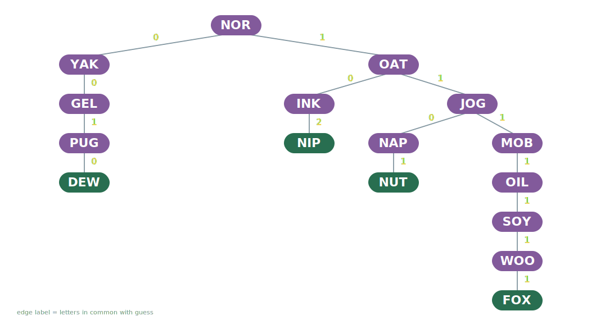
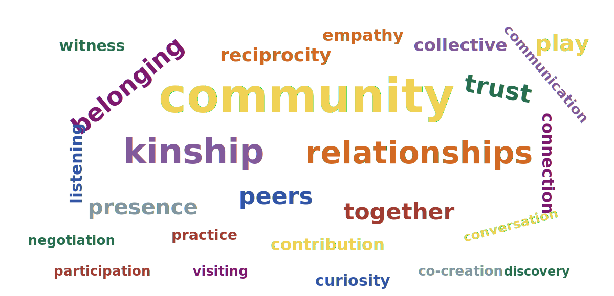
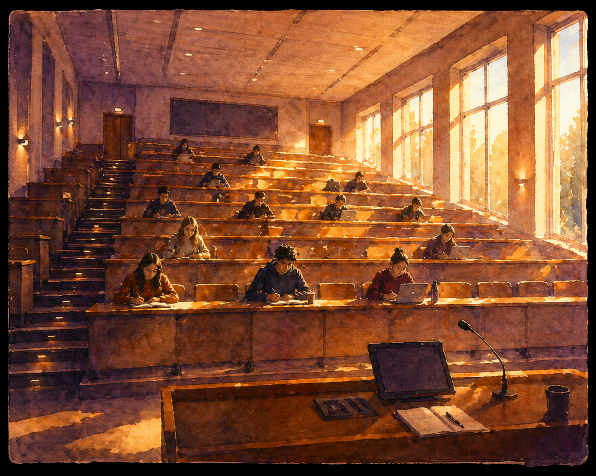
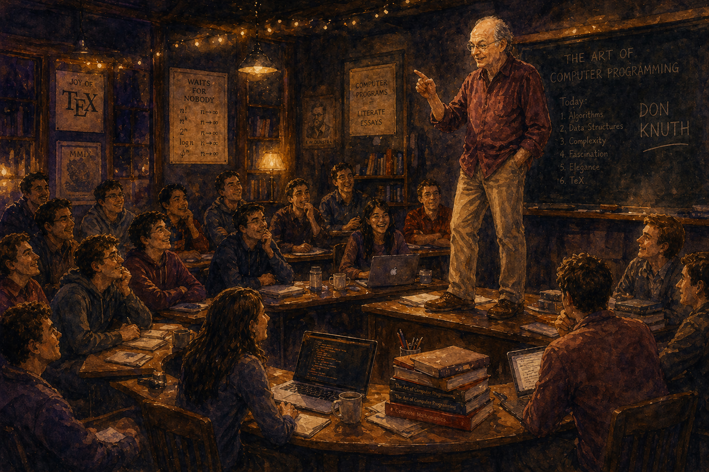
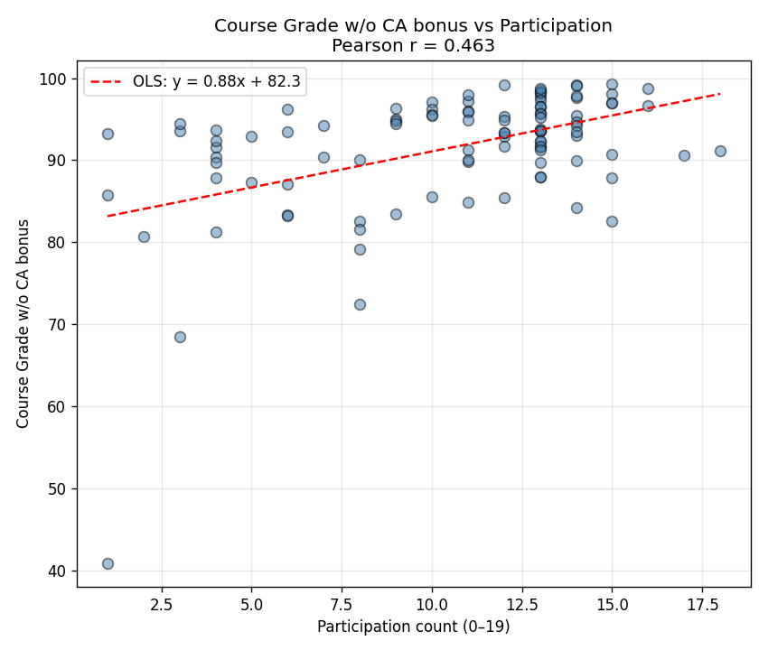

# Let's Play a Game...

<!-- SLIDE 1: JOTTO — the opening activity -->

## Jotto

<pre style="font-size: 3rem; font-weight: bold; text-align: center; line-height: 2; letter-spacing: 0.05em; border: none; box-shadow: none; background: transparent;">
MOB    YAK    GEL    NIP
OAT    PUG    FOX    NOR
WOO    INK    SOY    JOG
NUT    DEW    NAP    OIL
</pre>

Pick one. Make sure everyone knows and agrees.

::: {.notes}
NO PREAMBLE. Walk in. Start the slide. Say:

You are the wordle master and i'm going to try to guess your word. Pick one word from among these, and make sure everyone knows and agrees. I'll leave it to you to organize that -- i'm going to step out for a break. You have 45 seconds.

Return to the BACK of the room. They turn to look.

Advance to the next slide — decision tree. Play Jotto from the back of the room. Ask your questions. Narrow it down. Guess the word.

Win or lose — either is interesting.

Then walk to the front.

"That's a decision tree. And that only works in a room."

Pause.

:::

<!-- SLIDE 2: JOTTO decision tree -->

## My Jotto Algorithm

{fig-align="center" width="100%"}

::: {.notes}

The difference in this game is that you just tell me *how many* letters my word has in common with yours. (how many of your letters are covered by mine.)

Play the game from this tree. First guess is NOR.

walk to front.

This is my algorithm for playing Jotto with you. 

The structure is called a decision tree -- the edges correspond to an answer to a question posed via the vertices. 

Do you like this tree? 

What makes it good or bad? What's the best we could hope for?

This is the "worst strategy" decision tree for these words — deliberately bad splits.

Play a round with a neighbor, using this tree, so you can see exactly how it works. 

"Wait — this isn't class. You don't have to answer."

:::

<!-- SLIDE 3: Two visions — "That's how I want to teach" -->

## How I want to teach...

{fig-align="center" height="550"}

::: {.notes}
After Jotto. Gesture back at the game.

"That's how I want to teach. Every day. All the time."

Pause. Then advance.
:::

<!-- SLIDE 4: Two visions — "That's how they think they should learn" -->

## How they believe they learn...

{fig-align="center" height="550"}

::: {.notes}
"That's how they think they should learn."

They value "learning efficiency" vs. "learning relationships"

Let the juxtaposition sit.

"This talk is about designing courses that reconcile these two realities."
:::

# Part A: Course Design

<!-- SLIDE 5: Course design scope -->

## Course Design

::: {style="font-size: 1.7em; text-align: center; margin-top: 2em;"}
learning activities + assessments
:::

::: {.notes}

I spent this last year building 2 new classes and revamping a 3rd, so my course design engine is still active -- it's the only thing I know how to talk about at this poitn.

Course design is two things: learning activities and assessment. Assessment is its own desperate conversation. Today is about learning activities.

Circle or highlight "learning activities" on the iPad.

Maybe add + policies, but it's too early in the day for a nap. Also, these components aren't exactly disjoint. 
:::

<!-- SLIDE 6: The changing landscape -->

## A Puzzle

{fig-align="center" height="500"}

::: {.notes}

idea for image -- each student is a puzzle piece, disassembled.

"Our landscape is changing. Research and analysis is emerging, but here's what I've been noticing — and maybe you have too."

- Quieter fora
- Quieter classrooms
- Quieter office hours
- An overt dependence on external sources of content

"Raise your hand if you've been noticing it too."

Pause.

"I view this as an acceleration of things that have been happening for a long time. In 2012 a student came to me with a YouTube video about DFS. It was a concise, correct example, delivered when the student wanted to hear it. That was just a foreshadowing."

"And it might be true that they learn the material well enough to meet the standards we've set for them — historically, proving to us that they know the content. But it turns out content was the low-hanging fruit. We have to work harder to teach them what's really important — what will differentiate them from the things that can be automated."
:::

<!-- SLIDE 7: The imperative -->

## The Goal

::: {style="font-size: 1.1em; margin-top: 1em; text-align: center;"}
Design learning activities that provide something a private tutor **cannot**.
:::

{fig-align="center" width="100%"}

::: {.notes}
This is the imperative. Not better content delivery — we've lost that race. But something a 1:1 interaction structurally cannot produce.

(Jotto, and the ensuing discussion of decision trees is an example.)

Then reveal the cloud. "All of this. None of it happens 1:1. None of it happens with a tutor. These are the things we can offer that nothing else can — and they all run counter to the isolation of individual learning."

The rest of part A is about how to design more of them, but first I want to justify the approach, in case you're dubious.
:::

<!-- SLIDE 6: Community is the learning -->

## The Lesson of Puzzled Pint

{fig-align="center" width="100%"}

::: {.notes}

Sitting at a bar with old friends, new friends, former student, child's girlfriend... very diverse group. All were solving, and Rose and I "got" something... we BOTH had the feeling of conquest! It was simply great. Everyone engaged. joyful, motivated by social connections. 

I know that you all already know this, but I want to get us on the same page.
This is not new, but now it's essential -- it used to be a nice-to-have. We have done all the low hanging fruit wrt pedagogy.

Woolley et al.: groups have a measurable collective intelligence — a c-factor — not predicted by any individual member's intelligence. The group produces solutions no member could reach alone. (Puzzled Pint story.)

Lave & Wenger: learning is participation in a community of practice, not transfer of information. Structurally impossible 1:1.

Wegner transactive memory: groups develop shared awareness of who knows what, divide cognitive labor. The group itself becomes a cognitive system.

"Every workplace is a group project. We're practicing."

This is not a theme — it's the substrate. Everything that follows is designed for a room.

Sitting at a bar with old friends, new friends, former student, child's girlfriend... very diverse group. All were solving, and Rose and I "got" something... we BOTH had the feeling of conquest! It was simply great. Everyone engaged. joyful, motivated by social connections. 
:::

<!-- ============================================================ -->
<!-- LEARNING IN COMMUNITY (Beat 5 in outline)
<!-- ============================================================ -->

## Learning in Community

::: {.fragment}
Collective intelligence allows groups to outperform individuals on many tasks. &emsp; *(Woolley et al., 2010, Science)*
:::
::: {.fragment}
Learning emerges through participation in communities of practice. &emsp; *(Lave & Wenger, 1991)*
:::
::: {.fragment}
Cognitive division of labor in groups reduces individual load and supports flexible thinking. &emsp; *(Wegner, 1987)*
:::

::: {.notes}
Three ideas, briefly:

**Collective intelligence** — Woolley: groups have a measurable c-factor, not predicted by any individual's intelligence. The group produces solutions no member could reach alone.

**Situated learning** — Lave & Wenger: learning is individual, but the conditions that produce the deepest learning are communal. Structurally impossible 1:1.

**Transactive memory** — Wegner: groups develop shared awareness of who knows what. When someone you trust carries part of the cognitive load, your brain is freer to be creative. Also structurally impossible 1:1.

**Computational Indigenuity** — Jon Corbett: an Indigenous Computing Framework is a story about how we are related to the various aspects of a computing system. Relationality is key. Everything is related. The same principle that makes Indigenous frameworks coherent makes a classroom coherent — the relations between people are the substance, not the scaffolding.

Puzzled Pint — I'm a learner in this context too. I've experienced all of this firsthand.

"Every workplace is a group project. We're practicing."
:::

## A Few Examples {#the-list}

::: {style="font-size: 0.85em; columns: 2; column-gap: 0.5em;"}
| # | Story | Concept |
|---|-------|---------|
| [1](#candy-hearts) | Candy Hearts Factory | stacks |
| [2](#love-letters) | Donkey and Dragon | BFS |
| [3](#muddy-city) | Muddy City | MST |
| [4](#sages) | Sages & Tricksters | logic |
| [5](#billboard) | Billboard Hot 100 | ordered data |
| [6](#heist) | The Great Data Heist | dictionaries |
| [7](#isomorphism) | Graph Isomorphism Detective | graph theory |
| [8](#birthday) | Birthdays | hashing |
| [9](#jotto) | Jotto | decision trees |
| [10](#genome-assembly) | Genome Assembly | Euler paths |
| [11](#voronoi) | Voronoi Seurat | BFS |
| [12](#mhall) | Mary Had a Little Lamb | Markov chains |
| [13](#literary) | Literary Social Networks | NLP + graphs |
| [14](#eulers-formula) | Slippery Puzzle | planar graphs |
| [15](#campus-walks) | Campus Walks ★ | graphs |
| [16](#bird-staging) | Bird Staging ★ | divide & conquer |
| [17](#musical-influence) | Musical Influence Explorer ★ | BFS/DFS/SCC |
| [18](#game-of-life) | Game of Life ★ | cellular automata |
| [19](#pokemon) | Pokémon Explorer ★ | data frames |
| [20](#genomic-intervals) | Genomic Interval Explorer ★ | interval trees |
:::

★ = independent project &emsp; *I've prepared 20 talks. Pick two.*

::: {.notes}
Audience participation. Hold up fingers for choice number. Take a photo. Tally.

The joke lands here: "I've actually prepared 20 talks today. You're choosing 2."

The point of the list is the volume and variety — art, music, nature, wellness, mystery, games, biology, literature. Don't read it aloud. Let them scan it. Give them 20 seconds.

Prepared anchors: Euler's Formula (#20) and Candy Hearts (#1). Voronoi (#11) is available but not the default — it's strong on sensory design, weaker on community dependency.
:::

<!-- ============================================================ -->
<!-- CANDY HEARTS FACTORY -->
<!-- ============================================================ -->

## Example 1: Candy Hearts {.class-demo}

<iframe src="class_demos/05_mon_stacks.html#/abstract-data-type-adt-stack"></iframe>

DSCI 221

::: {.notes}
"Here's how stacks are normally taught. A stack is a LIFO data structure. Push. Pop. Peek. This is what they can get anywhere, any time."
:::

## Example 1: Candy Hearts {.class-demo}

<iframe src="class_demos/candy_hearts_story.html"></iframe>

DSCI 221

::: {.notes}
"It's the night before Valentine's Day at the candy heart factory. The hearts got mixed up on the conveyor belts."

I love Advent of Code puzzles — this problem structure came from there. An agent helped me build the personalized instances. The vision was mine; the execution was collaborative.

Each student gets a unique input — their own factory floor. They execute the stack operations themselves, in code. They don't know yet what they're building toward.
:::

## Example 1: Candy Hearts {.class-demo}

`[IMAGE: the reveal — a student's output spelling their personalized wellness message]`

[← back to the list](#the-list)

::: {.notes}
"What word is spelled out by the letters on top of each belt?"

Every student's answer is different. Every student's message is personal — "you got this", "breathe", "keep going."

The conveyor belt story uses actual student names. The preamble has their names in it. And what happened, without being asked: students started reading their lines aloud. Spontaneously. The room performed the story together.

They learned stacks. They also got a Valentine. And they performed it for each other without anyone asking them to.
:::

## Candy Hearts Recap

- Thanks to "Advent of Code" for the problem idea.
- Candy Factory Story was just the problem spec.
- Students read aloud without my prompting!!
- Wellness messaging is a theme.

`[IMAGE: PL workspace screenshot — students writing the stack operations]`

::: {.notes}
Each student gets a unique input — their own factory floor, their own set of instructions. They execute the stack operations themselves, in code. They don't know yet what they're building toward.

NOTE: For the talk, have a pre-loaded screenshot or screen recording of the PL workspace ready.
:::

<!-- ============================================================ -->
<!-- EULER'S FORMULA -->
<!-- ============================================================ -->

## Example 14: A Slippery Puzzle {.class-demo}

A &nbsp; B &nbsp; C

Find a rule that applies to everyone's set of numbers.

::: {.notes}
"I have a deck of index cards. On one side: a graph. On the other side: three numbers."

Distribute one card per student (or pair), number-side up.

"Ignore the graph side. You've got three numbers. Find a rule that applies to everyone's set of numbers."

The misdirection is the whole setup. They're about to discover Euler's formula themselves — they just don't know it yet.
:::

## Example 14: A Slippery Puzzle {.class-demo}

A: &emsp;&emsp;&emsp;&emsp;&emsp; B: &emsp;&emsp;&emsp;&emsp;&emsp; C: &emsp;&emsp;&emsp;&emsp;&emsp;

How do the numbers relate to the graph on the flip side?

::: {.notes}
Give them 60–90 seconds. Some will see it quickly, some won't.

The relationship: one number + 2 equals the sum of the other two.
(E + 2 = V + F, equivalently V - E + F = 2, but they don't know that yet.)

Once a few have it, ask: "Does anyone want to share a conjecture?"

Hear two or three. Then hand the iPad to someone and ask them to write the rule. They write something like A + B = C + 2. The room sees the formula in a participant's handwriting, not yours.

Don't confirm or correct. Say: "Now flip your card."
:::

## Example 14: A Slippery Puzzle {.class-demo}

::: {style="text-align: center; margin-top: 1em;"}
*In any connected planar graph,*

$$V - E + F = 2$$

*where V is the number of vertices, E the number of edges, and F the number of faces.*
:::

[← back to the list](#the-list)

::: {.notes}
Now put the formula on screen. They already know it.

That's the narrative arc: a formula they've known for five minutes, discovered by the room. This is the cleanest example of community as epistemological necessity in the whole talk. The activity structurally requires neighbors. There is no solo path to verification.
:::

## Slippery Puzzle Recap

- Proof by induction follows.
- Originally designed as an ice-breaker. 
- Students *need* to interact.
- Why is it called "Slippery Puzzle?"

<!-- ============================================================ -->
<!-- METHODOLOGY (Beat 9)
<!-- ============================================================ -->

## Unifying Features

`[IMAGE: five moves, a repeating pattern, something that clicks into place]`

::: {.fragment style="margin-top: 0.8em;"}
1. **Acknowledge the canonical treatment** — *give them the starting place for independent study*
2. **Situate in an authentic, motivating context** — *find something delightful*
3. **Design for active knowledge construction** — *don't tell them anything, make them speculate*
4. **Make structure perceptible** — *illuminate a metaphor, or make things sensory*
5. **Culminate in authentic production** — *nurture their ability to build things*
:::

::: {.fragment}
**Community underlies all of it.** These moves are designed for a room.
:::

::: {.notes}
"Let's name what just happened."

This is recognition, not instruction. They've seen two examples. Each step should land as "oh — that's what that was."

Important framing: "I didn't design this methodology and then build the lessons. I built the lessons — and then noticed what they had in common. This is a retrospective analysis, not a blueprint."
:::

<!-- ============================================================ -->
<!-- RESEARCH (Beat 10)
<!-- ============================================================ -->

## Does it work?

`[IMAGE: four small images — brain/dopamine, enthusiastic teacher, human pyramid, students working on something real]`

::: {.fragment}
Curiosity enhances memory encoding. &emsp; *(Gruber et al., 2014, Neuron)*
:::
::: {.fragment}
Teacher enthusiasm is associated with increased student engagement and enjoyment. &emsp; *(Frenzel et al.)*
:::
::: {.fragment}
Metaphors support understanding by mapping structure between domains. &emsp; *(Gentner, 1983)*
:::
::: {.fragment}
Authentic, real-world tasks often increase student motivation. &emsp; *(PBL meta-analyses, 2024)*
:::

::: {.notes}
Fast. These are explanations for what they just experienced, not arguments to convince them. They felt it already.
:::

---

<!-- ============================================================ -->
<!-- THE HINGE (Beat 11) — end of Part A
<!-- ============================================================ -->

## What's the fatal flaw?

::: {.fragment}
{fig-align="center" height="500"}
:::

::: {.notes}
"So — what's the fatal flaw?"

Pause. Let the room answer. Someone will say it.

"It only works if they're in the room."

Nod.

"Everything I just showed you — the methodology, the research, the activities — all of it assumes a room full of people. And that assumption is getting harder to defend every semester."

I want to give us all a minute to consider and discuss "Where is everyone else?"
:::

<!-- ============================================================ -->
<!-- PART B — Getting Students to Invest in the Community
<!-- ============================================================ -->

<!-- Beat 12: The confession -->

# Part B: Attendance

## I Was Missing

{fig-align="center" height="500"}

::: {.notes}
"I want to be honest about something. I am not the right person to lecture anyone about attendance."

I was that student. I skipped class constantly. Not because I didn't care — I cared deeply about my education. But I was impulsive with my time. I overestimated my ability to catch up later. I told myself I'd go next time. And the longer I stayed away, the harder it was to go back.

A top 10 biggest regret for me: I was enrolled in Concrete Math with Don Knuth the last time he taught it, and I attended approximately half the time. 

He is an incredible and dazzling teacher. I loved the material. I simply didn't feel invested -- no one would care if i skipped, and I lacked the emotional maturity to recognize what I was giving up.

:::

## Why? 

::: {.fragment}
**No kinship** — they don't feel the room needs them.
Belonging is essential. 
:::

::: {.fragment}
**Present bias** — immediate vs. delayed gratification. A volleyball game with friends is more appealing in the moment, and the cost of missing class is invisible.
:::

::: {.fragment}
**Overconfidence** — they believe they can catch up.
:::

::: {.fragment}
**Physical barriers** — commutes or jobs.
:::

::: {.notes}
Pivot from the personal to the general. "These are the patterns I see in my students now. They map to my own story. I'm guessing they map to some of yours too."

Deliver each fragment lightly. No moralizing. The "none of them is laziness" frame is doing the work.

What am I missing?

:::

<!-- Beat 13a: The extrinsic trap (move BEFORE asking what they've tried) -->

## I Caved

::: {style="font-size: 0.85em; columns: 2; column-gap: 0.5em;"}

{fig-align="center" height="500"}

\

\ 

But I am haunted by:

>External rewards erode intrinsic motivation &emsp; *(Deci & Ryan, 2000)*

:::

::: {.notes}
"I had never incentivized attendance until this term. I held out for years. And then this year I caved — I added an attendance threshold."

Pause.

"The minute they hit the threshold, attendance died. Like, immediately. Deci and Ryan could have told me that. External rewards erode the very motivation you're trying to encourage. They did tell me. I didn't listen."

Then reveal the chart.

"BUT — I ran the model on this term's data. Course score correlates with participation. r = 0.46. Real effect."

Reveal the fragment caption.

"So I was right to care. I was wrong about how. The question is no longer *whether* to drive attendance — it's *how* to do it without breaking it."

The point of putting this BEFORE "what have you tried?" — I don't want anyone to share a strategy and then feel like I'm criticizing them. Now the table is clear: extrinsic doesn't work long-term; the goal still matters; let's hear what you're doing.
:::

<!-- Beat 13b: What have you tried? -->

## What have *you* tried?

::: {.notes}
"Now that I've shown my cards — what have you tried? Shout it out."

Take 4–5 answers. React genuinely. Pattern-spot aloud: "Ok — that's a carrot... that's a stick... that one's structural, that's interesting..."

The earlier confession means people can share their extrinsic approaches without feeling judged — they know I've been there.
:::

<!-- Beat 14: What I'm trying instead -->

## A Tentative Framework:

::: {style="font-size: 0.85em; margin-top: 0.8em;"}

::: {.fragment}
**Structural design** — presence as a epistemologic necessity in learning activities
:::

::: {.fragment}
**Making the invisible cost visible** — make sure community values are transparent
:::

::: {.fragment}
**Social accountability** — create subgroups who expect to see them
:::

::: {.fragment}
**Pre-commitment** — students declare why being in the room matters, refer to it often
:::

::: {.fragment}
**Attendance Chart** — (Christine Goedhart) 

::: {.fragment}
**Recording as precondition** — absence must be a choice, not a constraint
:::

:::

:::

::: {.notes}

Three things were going on for me:

- **No kinship** — I didn't feel like the room needed me there, and I didn't feel like I needed it. Belonging is the entry point; kinship is the durable form. The designed classroom is the only learning community where belonging is the default — but kinship has to be cultivated. When students opt out, the cost is unevenly distributed. I didn't know that cost existed.

- **Present bias** — I wasn't apathetic. I genuinely meant to show up. But the value of going with my friends to play volleyball is immediate; the value of being in the room is deferred and invisible.

- **Overconfidence** — I believed I could learn it all on my own, later. Maybe I could learn the content — but I couldn't learn the thing I didn't know existed, and it took a LOT longer.

"So now I'm on the other side of the desk, designing rooms that I desperately want students to be in. And the question is: how?"

"But here's the harder question — how do you convince a student who has already opted out? I have one answer. I suspect you have others. Let's talk about that too."

Note: I record everything and livestream every class. Students who can't be there have full access. If they're not showing up, it's a choice. And that choice has a cost they may not know about.

Deliver each one with a self-rating:

Structural design: "I think this one actually works. But I can't do it every day. It's an aspiration."

Making cost visible: "I do this. I don't know if it works. But it feels honest."

Named accountability: "I haven't tried this yet. I think it could be powerful — or weird."

Pre-commitment: "This might be completely delusional. But Gollwitzer says written intentions outperform held beliefs, so maybe it's only mostly delusional."

Recording: "This one I'm sure about. You can't ask people to show up and then punish them for having a life."
:::

---

<!-- Research supporting attendance strategies -->

##

::: {.fragment}
External rewards erode intrinsic motivation &emsp; *(Deci & Ryan, 2000)*
:::
::: {.fragment}
Written intentions outperform held beliefs &emsp; *(Gollwitzer, 1999)*
:::
::: {.fragment}
Belonging is the strongest predictor of persistence &emsp; *(Walton & Cohen, 2011)*
:::
::: {.fragment}
Kinship — relational accountability sustains presence &emsp; *(Wilson, 2008; Brayboy, 2005)*
:::
::: {.fragment}
Present bias: immediate costs outweigh deferred value &emsp; *(O'Donoghue & Rabin, 1999)*
:::

::: {.notes}
Same format as the earlier research slides. Fast.

Deci & Ryan: this is why graded attendance backfired. Extrinsic motivation crowds out intrinsic.

Gollwitzer: implementation intentions — "I will go to class, and I've told Priya I'll be there" — categorically more robust than a held intention. This is the mechanism behind pre-commitment and named accountability.

Walton & Cohen: a brief belonging intervention in first year closed the achievement gap for underrepresented students over three years. Belonging isn't a nice-to-have. It's load-bearing.

Kinship — Shawn Wilson and Bryan Brayboy: Indigenous scholarship has long named what western research is just catching up to. Kinship is more than belonging — it's relational accountability. You show up because the others are *yours* and you are *theirs*. This connects directly to Corbett's framing: everything is related. The classroom becomes coherent the same way an Indigenous Computing Framework does — through relations, not transactions.

O'Donoghue & Rabin: present bias is not laziness. Students genuinely intend to come. The asymmetry between immediate cost and deferred value is structural. Design has to account for it.
:::

---

<!-- Kinship in CS practice -->

## Kinship in practice

::: {style="font-size: 0.95em; margin-top: 1.2em;"}

::: {.fragment}
**Knowledge reciprocity** — students document bugs and fixes in a shared classroom knowledge base. Their insights sustain everyone else's progress.
:::

::: {.fragment style="margin-top: 0.6em;"}
**Peer mentorship by visiting** — students move between groups to listen and support, not to solve. The goal is presence, not rescue.
:::

:::

::: {.notes}
"Kinship sounds abstract. Here's what it can look like in a CS classroom."

**Knowledge reciprocity:** Instead of solo-coding for a grade — extraction — students contribute to a shared knowledge base. Bugs they hit, fixes they found. The next student who hits the same wall finds it because someone else was there. Presence becomes contribution; absence becomes a small absence in the shared resource.

**Visiting (not solving):** Structured time where students move between groups. The rule is listen, ask, support — don't take over. This is the opposite of the "TA who fixes everything" model. It positions every student as someone whose presence matters to someone else.

These ideas are drawn from Indigenous methodologies (Wilson, Brayboy) and the Computer Science Teachers Association's work on relational pedagogy. They name a different theory of why students should be in the room — not because they owe me attendance, but because they owe each other presence.
:::

---

<!-- Beat 15: Table activity — attendance -->

## Your turn

::: {style="font-size: 0.9em; margin-top: 1em;"}

1. What's working for you right now? What gets students to show up — and stay engaged?
2. What have you tried that backfired?
3. If you could design one structural feature — built into the lesson, not the syllabus — that makes presence matter, what would it be?

:::

::: {.notes}
"I've shared my ideas. But I said at the start: I suspect this room has better ones. Let's find out."

~5 min introductions. ~10 min brainstorm. Brief share-out.

This is the mirror moment: the talk itself is a demonstration of what it's arguing for. The table activity in the first half would have been about lesson design — fine, but familiar. Placing it here, on a problem nobody has solved, makes the stakes real.

"Something will come out of this conversation that none of us walked in with. When it does — that's the c-factor. Live. In this room."
:::

---

<!-- Beat 16: Closing -->

##

::: {style="text-align: center; font-size: 1.3em; padding-top: 1.5em;"}
A tutoring system answers your question.

::: {.fragment}
A teacher opens the gap that makes you realize
you had a question in you all along —
:::

::: {.fragment}
and the moment you feel that gap,

**your brain is already learning.**
:::
:::

::: {.notes}
Let it breathe. No summary after this.
:::
